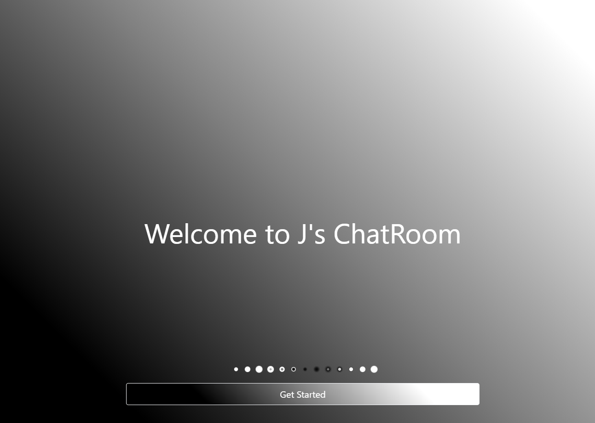
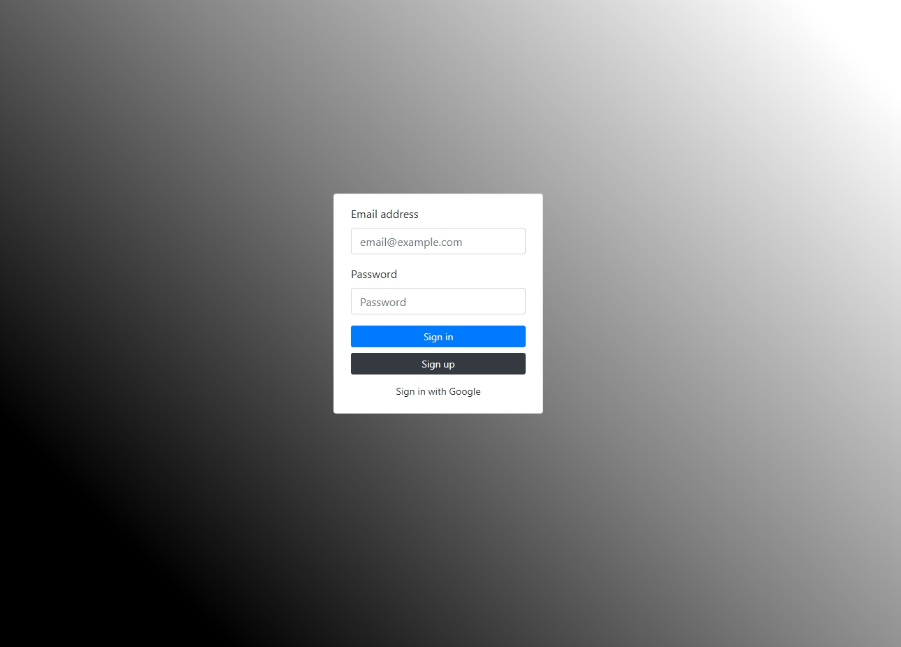
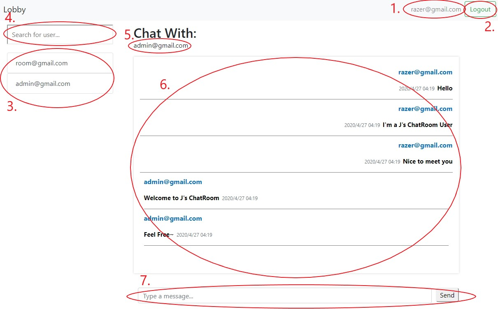
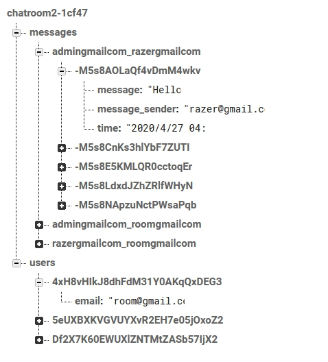
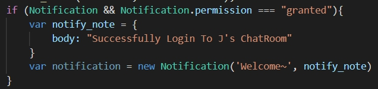
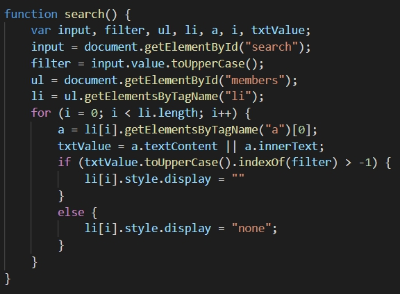
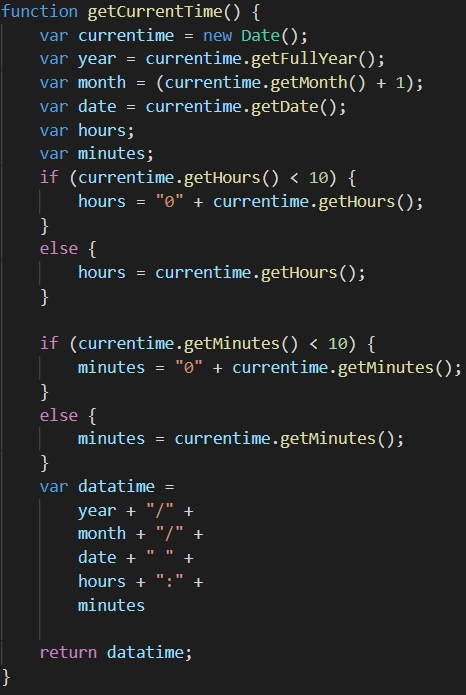
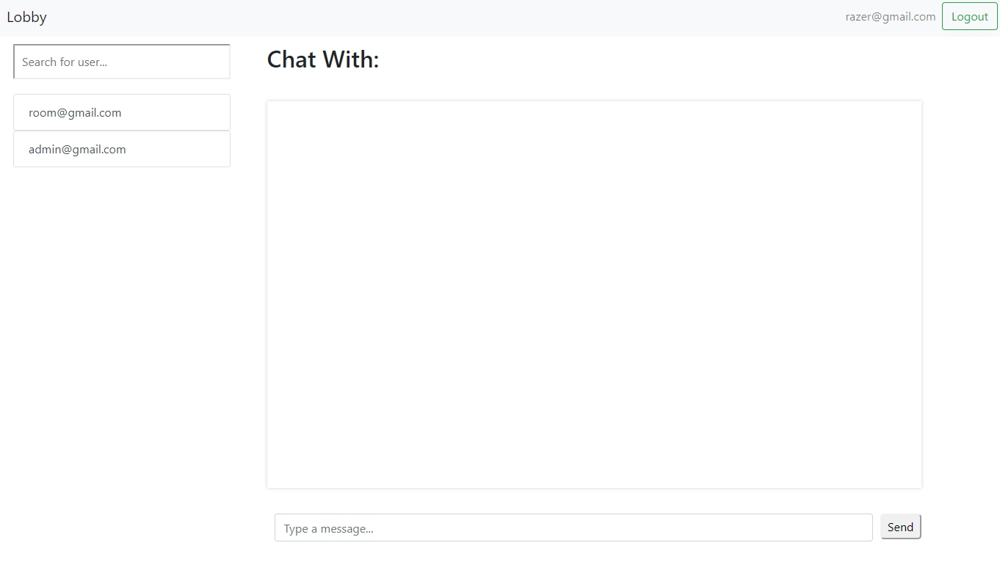
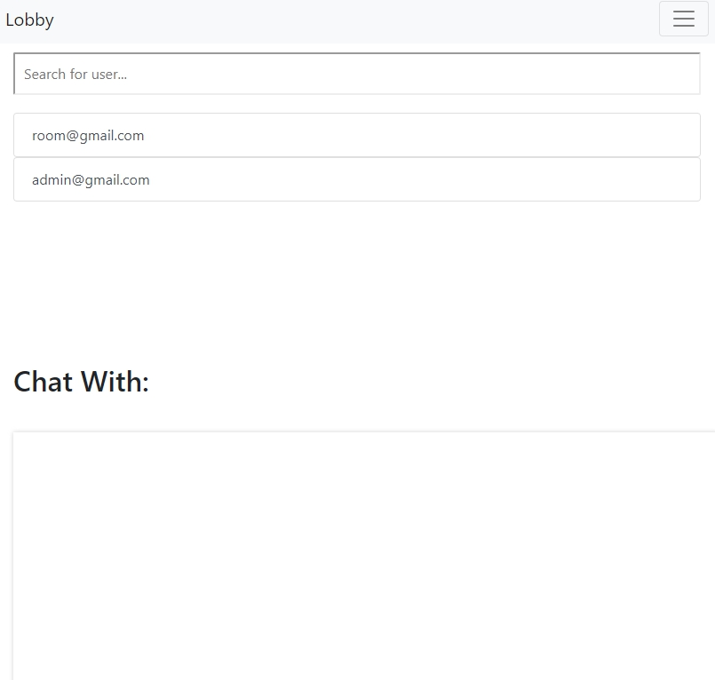
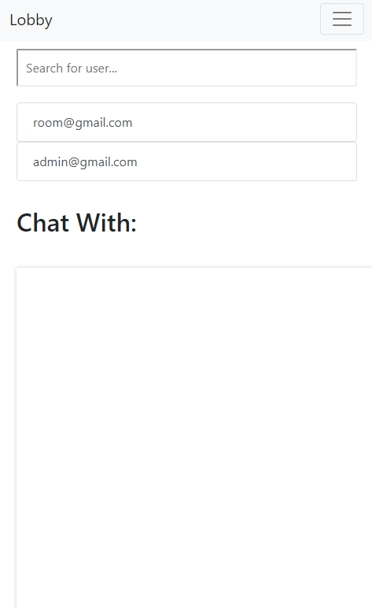

# Software Studio 2020 Spring
## Midterm Project --- J's ChatRoom

### Scoring

| **Basic components**                             | **Score** | **Check** |
| :----------------------------------------------- | :-------: | :-------: |
| Membership Mechanism                             | 15%       | Y         |
| Host on your Firebase Page                       | 5%        | Y         |
| Database read/write                              | 15%       | Y         |
| RWD                                              | 15%       | Y         |
| Topic Key Functions                              | 20%       | Y         |

| **Advanced tools**                               | **Score** | **Check** |
| :----------------------------------------------- | :-------: | :-------: |
| Sign Up/In with Google                           | 2.5%      | Y         |
| Add Chrome notification                          | 5%        | Y         |
| Use CSS animation                                | 2.5%      | Y         |
| Deal with messages when sending html code        | 5%        | Y         |

| **Other useful widgets**                         | **Score** | **Check** |
| :----------------------------------------------- | :-------: | :-------: |
| Search bar for User                              | 1~5%      | Y         |
| Message's Sending time                           | 1~5%      | Y         |
| Press Enter to Sign in                           | 1~5%      | Y         |
| Press Enter to Send Message                      | 1~5%      | Y         |

---

### How to use 

#### Main Page
 

Press "Get Started" button and you will go to the login page

#### Login Page

##### For new user
1. Input email and password
2. Press "Sign Up" button

##### For old user
1. Input email and password you have used to register
2. Press "Sign In" button or Press Enter

##### For Google user
1. Press "Sign in with Google"
2. Complete your Google Login

When Sign in Successfully. <b>It will show a Google Notification</b>

#### Lobby Page

1. Show the user who is Login
2. Press it to Logout <b>It will show a Google Notification</b>

3. All the user in J's ChatRoom
4. Search bar for seraching all the users in J's ChatRoom
5. The user you are chatting with
6. Show all history messages for you and the user you are chatting with <b>(With Sending time)</b>
7. Type message and Send

### Firebase Structure

### Functions

#### Main Page
1. CSS Animation

#### Login Page
1. Use <b>createUserWithEmailAndPassword()</b> to create new user 
When a user is created, I pushed the email to Firebase under a folder "users"
2. Use <b>signInWithEmailAndPassword()</b> to let user sign in
3. Use <b>provider = new firebase.auth.GoogleAuthProvider()</b> 
<b>signInWithPopup(provider)</b> to let user sign in with google
4. Use the Code below to implement Google notifications 

#### Lobby Page
1. Use <b>signOut()</b> to logOut user
2. Use a list to store all users and show it on the left side
3. Use the code below to search user in the ul

4. Use below Code to get current time

5. When a messages is send, I make an unique ID by Sender's and Reciever's email. And push <b>message, message_sender, time</b> to Firebase under a branch "messages/unique ID"

#### RWD
1. Large

2. Medium: Move the ChatRoom to the buttom

3. Small: Minimize the User List to show only 2 members(Original:5) 

### Webpage link
https://chatroom2-1cf47.web.app/
